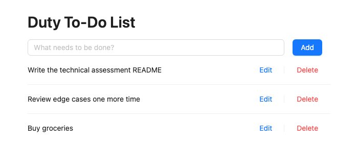

# Duty To-Do List

End-to-end to-do list app: read, create, update, and delete "duties". React + TypeScript (strict) frontend, Node.js + Express + TypeScript (strict) backend, PostgreSQL storage accessed with plain SQL (no ORM).



## Project structure

```
asm/
├── docker-compose.yml   # optional: provisions a local Postgres instance
├── backend/             # API server — see backend/README.md
└── frontend/            # web client — see frontend/README.md
```

Backend and frontend are two fully independent projects (separate `package.json`, no shared code, no shared dependencies) that communicate only over HTTP.

## Quick start

1. **Database** — either run Postgres via Docker (from the repo root):

   ```bash
   docker compose up -d db
   ```

   or point the backend at a Postgres instance of your own (see [`backend/README.md`](backend/README.md) for the manual setup, including the SQL schema to run).

   If port 5432 is already taken on your machine (e.g. by a locally installed Postgres), create a `.env` file at the repo root with `DB_HOST_PORT=5433` (or any free port) before running `docker compose up -d db`, and use that port in the backend's `DATABASE_URL` instead.

2. **Backend**:

   ```bash
   cd backend
   npm install
   cp .env.example .env   # Windows without Git Bash/WSL: copy .env.example .env
   npm run dev
   ```

   The API listens on `http://localhost:3000` by default.

3. **Frontend** (in a second terminal):

   ```bash
   cd frontend
   npm install
   cp .env.example .env   # Windows without Git Bash/WSL: copy .env.example .env
   npm run dev
   ```

   Open the URL Vite prints (`http://localhost:5173` by default).

Full details, including all available scripts, the API reference, and test commands, are in each project's own README: [`backend/README.md`](backend/README.md) and [`frontend/README.md`](frontend/README.md).

## Architecture at a glance

Both projects follow a layered structure so each piece can be understood, tested, and extended on its own:

- **Backend**: `routes -> controller -> service -> repository -> PostgreSQL`. Each layer only depends on the one below it — the repository is the only place that knows SQL, the service is the only place with business rules, and the controller only deals with HTTP.
- **Frontend**: `pages -> hooks -> services -> API`. `useDuties` is the single source of truth for the duty list; components (`DutyForm`, `DutyList`, `DutyItem`) receive data and callbacks as props and hold no fetching logic of their own.

This separation is what lets either side grow (new fields, new endpoints, new screens) without the change rippling through the whole codebase.

## Testing

Both projects use Jest.

```bash
cd backend && npm test               # unit tests, no database required
cd backend && npm run test:integration   # requires a running database
cd frontend && npm test
```

## Notes on constraints followed

- No ORM or query builder in the backend — every query in `duties.repository.ts` is plain SQL through `pg`.
- No Next.js or any server-side rendering in the frontend — it's a pure client-side Vite/React app.
- No Redux, `useReducer`, or other state management library — `useDuties` holds all list state in a few `useState` calls. (Ant Design's `Form` manages its own internal field state, which is the UI library's own concern, not an application-level state management solution.)
- Delete and the Ant Design component library are both implemented as the optional requirements suggested.
